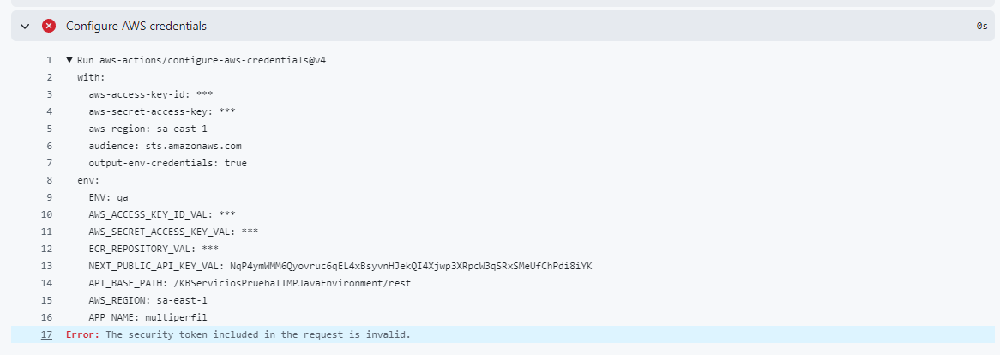

Muchas gracias ya funciona!!!, pero te cuento que quise redesplegar mi rama develop (qa)

y me salió ese error que te muestro en la foto:

Run aws-actions/configure-aws-credentials@v4
with:
aws-access-key-id: **_
aws-secret-access-key: _**
aws-region: sa-east-1
audience: sts.amazonaws.com
output-env-credentials: true
env:
ENV: qa
AWS_ACCESS_KEY_ID_VAL: **_
AWS_SECRET_ACCESS_KEY_VAL: _**
ECR_REPOSITORY_VAL: \*\*\*
NEXT_PUBLIC_API_KEY_VAL: NqP4ymWMM6Qyovruc6qEL4xBsyvnHJekQI4Xjwp3XRpcW3qSRxSMeUfChPdi8iYK
API_BASE_PATH: /KBServiciosPruebaIIMPJavaEnvironment/rest
AWS_REGION: sa-east-1
APP_NAME: multiperfil
Error: The security token included in the request is invalid.
