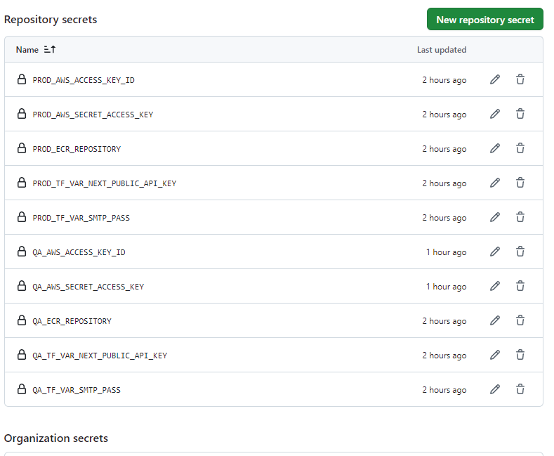

La idea es que no quede nada harcodeado y todo sea por variables.

Antewriormente todo funciona correctamente, todo esto ha sucedido a raiz que migre mi repo y modifique el pipeline. Adicional se recrearon inclusive nuevo secreto aws (aws detectó que cambie de repo y me lo exigió)
